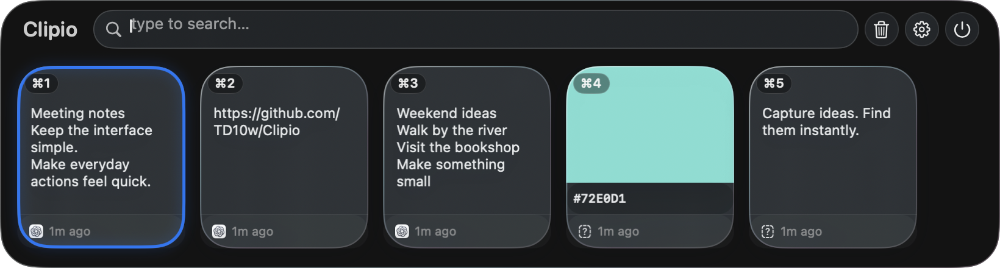
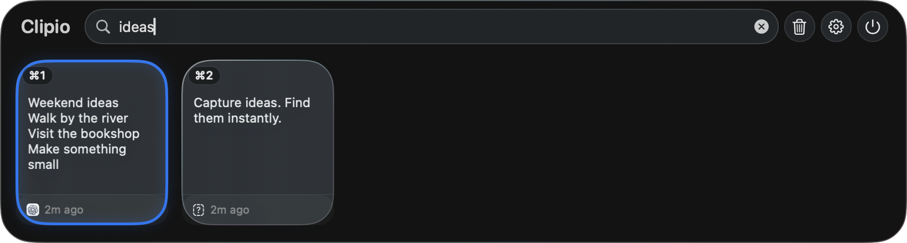

# Clipio

[English](README.md) · [简体中文](README.zh-CN.md)

基于 [Maccy](https://github.com/p0deje/Maccy) 开发的原生 macOS 剪贴板管理器，以横向卡片展示复制历史。

浏览文字、图片、文件和颜色值，搜索历史，并置顶常用内容。

**[下载 macOS 测试版 — 2.6.1-beta.1](https://github.com/TD10w/Clipio/releases/download/v2.6.1-beta.1/Clipio-2.6.1-beta.1.zip)** · [版本说明](https://github.com/TD10w/Clipio/releases/tag/v2.6.1-beta.1)

macOS 14+ · 支持 Apple Silicon 和 Intel · 已签名并通过 Apple 公证



*Clipio 深色透明界面，使用示例剪贴板内容。*



## 下载安装

**早期公开测试版。** 这是基于 Maccy 的独立个人项目。下载安装包使用不需要 Xcode，也不需要执行终端指令。

1. [下载 Clipio-2.6.1-beta.1.zip](https://github.com/TD10w/Clipio/releases/download/v2.6.1-beta.1/Clipio-2.6.1-beta.1.zip)，双击解压得到 **Clipio.app**。请选择这个 ZIP，不要下载 GitHub 自动生成的“Source code”源码压缩包。
2. 将 **Clipio.app** 拖入“**应用程序**”文件夹，然后打开。如果出现 macOS 正常的首次打开确认提示，确认打开即可。
3. Clipio 位于**菜单栏**，按 **Shift + Command + C** 打开卡片栏；它没有普通应用那样的 Dock 主窗口。
4. 在其他应用中复制内容，Clipio 会记录到历史。选中卡片按 **Return**，再到目标应用按 **Command + V** 粘贴。
5. 如需用 **Option + Return** 自动粘贴，在**系统设置 → 隐私与安全性 → 辅助功能**中允许 Clipio。

安装包包含两种芯片架构，已完成 Developer ID 签名、Apple 公证及凭据附加。**另一台 Mac 的安装体验和完整界面流程仍待独立测试。** 请将它作为早期测试版使用，遇到问题欢迎反馈。

当前采用手动更新：退出 Clipio，下载新版本，然后替换“应用程序”中的旧版本。更新后若自动粘贴失败，请重新检查辅助功能授权。本项目目前没有提供 Clipio 的 Homebrew 安装指令或 Mac App Store 版本。

如果 macOS 拒绝打开，请确认系统为 macOS 14 或更高版本，并从本仓库重新下载。在 [Issues](https://github.com/TD10w/Clipio/issues/new/choose) 中附上准确报错；无需全局关闭 Gatekeeper 安全检查。

可选的校验和验证方法见[版本说明](https://github.com/TD10w/Clipio/releases/tag/v2.6.1-beta.1)。

## 基本用法

Clipio 在菜单栏运行。在其他应用中复制内容，然后打开卡片栏。

| 默认快捷键 | 功能 |
| --- | --- |
| Shift + Command + C | 打开 Clipio |
| 打开卡片栏后输入文字 | 搜索历史 |
| Return | 复制选中项，再到目标应用按 Command + V 粘贴 |
| Option + Return | 自动粘贴到当前应用 |
| Option + P | 置顶或取消置顶选中项 |
| Escape | 关闭卡片栏 |

以上对应默认设置；开启“默认粘贴”会改变 Return 的行为。将鼠标停留在卡片上可查看预览。设置中可调整外观、历史条数、忽略的应用和搜索方式。

### 权限

自动粘贴需要在 **系统设置 → 隐私与安全性 → 辅助功能** 中允许 **Clipio**。仅复制卡片内容、再手动按 Command + V 不需要此权限。如果替换本地构建后无法自动粘贴，请重新检查辅助功能中的授权。

## 隐私与存储

历史记录通过 SwiftData 保存在本机，当前应用没有实现云同步或使用分析。默认退出后仍保留历史；默认历史上限为 200 条，置顶项不随普通历史淘汰。

本地保存不等于密码保险箱：数据库没有应用层加密。Clipio 会跳过支持的隐私或临时剪贴板标记，但无法识别所有以普通文字形式复制的密码或密钥。复制敏感内容前，可设置忽略相关应用或暂停记录。清空历史和清空系统剪贴板是不同的设置。

请勿在公开 Issue 中上传剪贴板数据库、完整设置、密码、令牌或未经脱敏的录屏。

## 测试与反馈

欢迎通过 [Clipio Issues](https://github.com/TD10w/Clipio/issues/new/choose) 用中文或英文反馈。请附上 Clipio 版本或 commit、macOS 版本、Apple Silicon / Intel、复现步骤、预期结果和实际结果。截图请使用示例内容。

优先测试：文字与图片复制、搜索、置顶、授权前后的粘贴、清空历史确认，以及复制数量超过历史上限时的行为。

已知限制：

- 处于早期测试阶段，采用手动更新；另一台 Mac 的安装体验和完整界面测试仍待验证。
- 图片或文件拖拽效果可能受目标应用影响，失败时请说明具体应用和操作。
- 新界面文字尚未完全本地化，辅助功能授权提示目前仅有英文。
- 数据库启动失败恢复、偶发的自动化窗口生命周期测试失败仍待跟进。请勿将剪贴板历史作为重要内容的唯一备份。

## 从源码运行（可选）

需要 **macOS 14 Sonoma 或更高版本**，以及完整的 **Xcode**（仅安装 Command Line Tools 不够）。使用与你的 macOS 兼容的 Xcode；首次构建需要解析和下载项目锁定版本的 Swift 依赖。

```bash
git clone https://github.com/TD10w/Clipio.git
cd Clipio
open Clipio.xcodeproj
```

选择 **Clipio** scheme 和 **My Mac**，运行项目。如果提示签名问题，在 Signing & Capabilities 中选择自己的开发团队。

也可以构建仅供自己电脑使用的优化版本，不自动安装：

```bash
./scripts/release-local.sh --build-only
open build/LocalRelease/Build/Products/Release/Clipio.app
```

这个本地签名版本不是供其他 Mac 下载的公证安装包。维护者发布时请参考[发布检查清单](docs/public-beta-checklist.md)。

## 演示与致谢

仓库中的[演示工程](Designs/Clipio-Demo/README.md)是一段 20 秒的产品重建动画，并非真实操作录屏，目前尚未发布审核后的导出视频。旧 Maccy App Store 素材不代表当前 Clipio 界面。

感谢 Alex Rodionov 及 Maccy 贡献者提供基础实现。上游版权声明、来源链接、内部名称与存储兼容名称会保留。Clipio 的问题请反馈到本仓库。

代码使用 [MIT 许可证](LICENSE)。第三方图片、字体和音频的授权需单独核对，详见[素材说明](docs/media-notes.md)。
